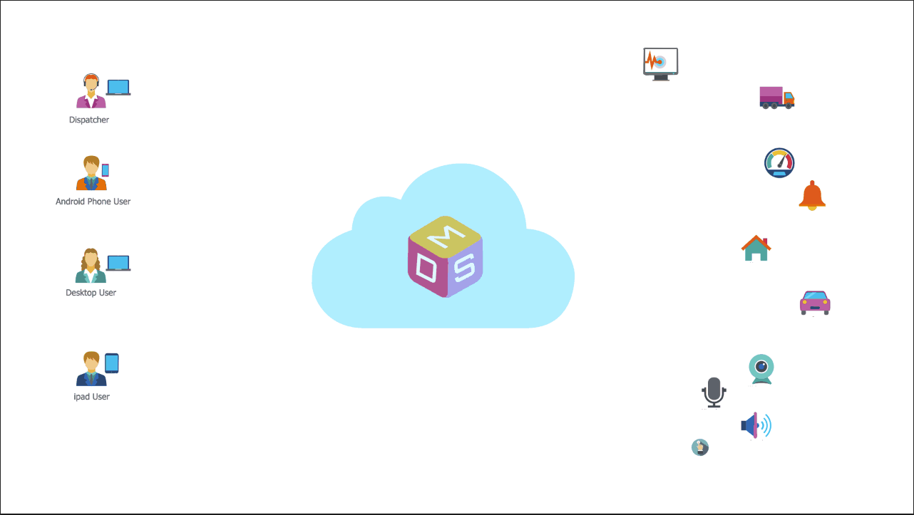

# Welcome to Multilinks

It is fair to say that most of us today are connected the cloud (what most people call the internet these days). We are connected 24/7, at home, at work and everywhere in between. However, most of the "things" in the real world in fact are not connected to the cloud and while these things are useful when we explicitly interact with them, they are not so useful when we don't.

Multilinks is a cloud-based platform aimed at making it easier for you (an application end-user/developer) to connect and communicate with other applications and Internet of things in real-time.

## The Big Picture

## How Does Multilinks Works

## Who Would Find Multilinks Useful
