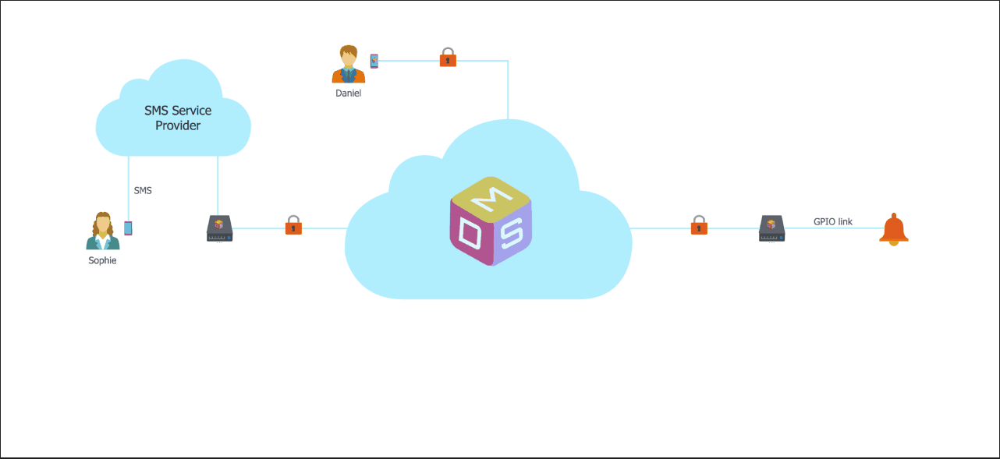

# Welcome to Multilinks

It is fair to say that most of us today are connected to the cloud, or what most people call the internet. We are connected 24/7, at home, at work and everywhere in between. However, most of the "things" in the real world are not connected to the cloud and while these things are useful when we can explicitly interact with them, they are not so useful when we can't.

But what if we had the option of interacting with these "things" from anywhere and in real-time?

The goal of Multilinks is to be a community-driven, cloud-based platform aimed at making it easier for anyone and everyone from end-user to developer to connect and communicate with other applications and the Internet of Things from anywhere and in real-time.

## The Big Picture

## How Multilinks Works

Simply speaking, the Multilinks platform is a digital postal/parcel delivery system. Its core function is to deliver labeled packages of data from point A to point B via a secure established link on behalf of the sender.

The Multilinks platform does not validate nor does it modify the packaged data in anyway. It is up to the sender to correctly pack and label the data in a way that the receiver can unpack and process/consume.

### Elements of Multilinks

The Multilinks platform can be broken down into 4 concepts:

#### Endpoints

   * An endpoint is a device running a Multilinks client (an application communicating with the Multilinks cloud-based platform).
   * The functionality of the endpoint is determined by the services the Multilinks client defines.
   * An endpoint is a protected resource; authorisation is required to use its services.

#### Users

   * Registered Multilinks users will be associated with either an `Application User` or `Application Developer` role. There will also be a `Multilinks Administrator` role to manage the platform. Registered users will be assigned the `Application User` role by default. This can be changed to `Application Developer` by the administrator.
      + Application User
         - Can create an endpoint by logging in a Multilinks client.
         - Can send link requests to other endpoints.
         - Can accept link requests from other endpoints.
      + Application Developer
         - Is also an application user.
         - Can create new clients and register them with the Multilinks platform.
         - Can add any services registered on the Multilinks platform to clients they created.
         - Can create new services and register them with the Multilinks platform.

#### Links

   * A Link is a data connection between two endpoints via the Multilinks platform.
   * Links are one-way data transfer connections (i.e. for a given link, one endpoint is always the sender and the other is always the recipient).
   * For a given pair of endpoints there can be no more than two links between them.
   * An endpoint can operate with no links associated with it.
   * Each link is unique and functions independently of other links.
   * A link can be deleted by the owner of either endpoints.

#### Services

   * An endpoint's functionalities are presented as services which can be invoked by another endpoint via their established link.
   * An endpoint's available services are defined by the device's hardware capabilities and the Multilinks client that it is running.
   * Each service will consist of the following:
      + `Service Name` - This is a user friendly label and is unique on the Multilinks platform.
      + `Version` - Characteristics of a service can change over time, so a version number is used to distinguish the change.
      + `Content Type` - Describe the payload data type (it is the responsibility of the sending endpoint to correctly serialise the payload so that the receiving endpoint can deserialise the payload correctly).
      + `Payload` - The data associated with this service type.

## Multilinks Applications In Real World Scenario

Let's go through a couple of scenarios of users with different requirements and technical backgrounds to see how they can use (or integrate) Multilinks with their solution. These scenarios will also demonstrate how one application created by one developer can easily interact with another application created by another developer.

#### Scenario 1: Sophie, The Software Developer

Sophie is interested in the state of a remote alarm `Code Orange` and she wants a SMS text sent to her mobile when `Code Orange` is activated or deactivated.
Sophie is a software developer and she is keen to build the applications required to solve her problem but she doesn't want to build or manage the backend services required or deal with the security concerns she has. So by integrating with Multilinks, her solution may look like something as follow:

   * A simple Multilinks client `App A` is created running on a Raspberry Pi (RPi).
   * `Code Orange` is linked to `App A` via a GPIO line.
   * Another simple Multilinks client `App B` running on a second RPi.
   * `App B` will integrate with a SMS service provider allowing it to send SMS to her mobile.
   * In order for `App A` to send alarm activation/deactivation events to `App B`, `App A` needs to send a one-time link request to `App B`.
   * The link request needs to be accepted before communication via the link is enabled.
   * Similarly, in order for `App B` to request `App A` to start/stop sending alarm activation/deactivation events, `App B` needs to send a one-time link request to `App A` (remember links are one-way).
   * This link request also needs to be accepted before communication via the link is enabled.
   * Once the links are established and `App B` has requested to be notified, on `Code Orange` activation/deactivation events, a message is sent from `App A` to `App B` via the Multilinks platform.
   * On receipt of a message from `App A`, `App B` will trigger a SMS to be sent to Sophie's mobile.

#### Scenario 2: Daniel, The Software Developer

Daniel is also interested in the state of `Code Orange` however does not want to be notified by a SMS text but instead have the notification sent to an app on his mobile.
Daniel is a software developer and like Sophie is keen to build his own mobile app but doesn't want to invest the effort into the backend services just so that he can keep track of an alarm. So by integrating with Multilinks, his solution may look like something as follows:

   * A simple Multilinks mobile client is created `App C` which he installs onto his mobile.
   * In order for `App C` on his mobile to be notified of `Code Orange` activation/deactivation events, Daniel will need to send a link request from `App C` to `App A` on Sophie's RPi.
   * Since Sophie is the owner of the device `App A` is running on, she will need to accept the link request.
   * Similarly, a link from `App A` to `App C` is also required and this time Daniel will need to accept the link request.
   * Once the links are established and `App C` has requested to be notified of `Code Orange` activation/deactivation events, a message is sent from `App A` to both `App B` on Sophie's second RPi and `App C` on Daniel's mobile.

> By now some will probably be wondering why the links have to be one way. The design decision was that a one way link will implicitly indicate which is the sender and which is the recipient; where the data is coming from and where it is going to. Therefore there are fewer elements to deal with when many events are happening independent of each other.

#### Scenario 3: Michael, The Tech Enthusiast

Michael is interested in the state of a remote alarm `Code Red` and similar to Daniel, does not want to be notified by a SMS text but instead have the notification sent to an app on his mobile.
Michael doesn't have a lot of software experience (especially mobile app development) but he's a tinkerer and knows his way around a Raspberry Pi. So with the help of Multilinks, his solution may look like something as follows:

   * Given `App A` and `App C` Multilinks clients are publicly available.
   * Like Sophie, Michael installs `App A` on his own RPi and connects to `Code Red` via a GPIO line.
   * `App C` is installed on Michael's mobile.
   * Like the previous scenarios, he creates a link from `App A` running on Michael's RPi to `App C` running on Michael's mobile and vice versa.
   * In this scenario, Michael only gets notified of `Code Red` events and not `Code Orange` events.
   * In this scenario, Sophie and Daniel only get notified of `Code Orange` events and not `Code Red` events.

#### Scenario 4: Chris, The Non-Technical Guy

Chris is interested in the state of both alarms `Code Orange` and `Code Red` and wants to have the notification sent to an app on his mobile. Lucky for Chris the process is pretty easy. With the help of Multilinks, his solution may look like something as follow:

   * Given the `App C` Multilinks client is publicly available.
   * `App C` is installed on Chris' mobile.
   * A link request is sent from `App C` on Chris' mobile to `App A` running on Sophie's RPi that `Code Orange` is connected to.
   * Sophie can choose to decline but she trusts Chris so accepts the link.
   * Similarly, Sophie sends a link request from her `App A` on her RPi to `App C` on Chris' mobile.
   * He sends a link request from `App C` on his mobile to `App A` on Michael's RPi that `Code Red` is connected to.
   * Michael can choose to decline but he trust Chris so approves the request.
   * Similarly, Michael needs to send a link request from his RPi `App A` to `App C` on Chris' mobile.
   * Chris can now receive notifications of activation/deactivation events from both alarms.

## In Conclusion

   * As mentioned at the start, Multilinks is basically a digital postal/parcel delivery system.
   * It ensures only authorised devices/applications can communicate with each other.
   * It allows devices/applications to communicate in real-time.
   * Any clients can connect to it (console app, desktop, mobile, SPA, Web services, native app running on edge devices) as long as the clients can communicate with [Multilinks Identity](https://github.com/ChrisDinhNZ/MultilinksIdentity/blob/master/README.md) and [Multilinks Core](https://github.com/ChrisDinhNZ/MultilinksCore/blob/master/README.md).
   * How the clients connect to real-world sensors/actuators is determined by the client implementation.
   * In theory anything can be connected, as shown in [the big picture](ABOUT_MULTILINKS.md#welcome-to-multilinks) as long as the clients receiving the data can unpack and process it.
